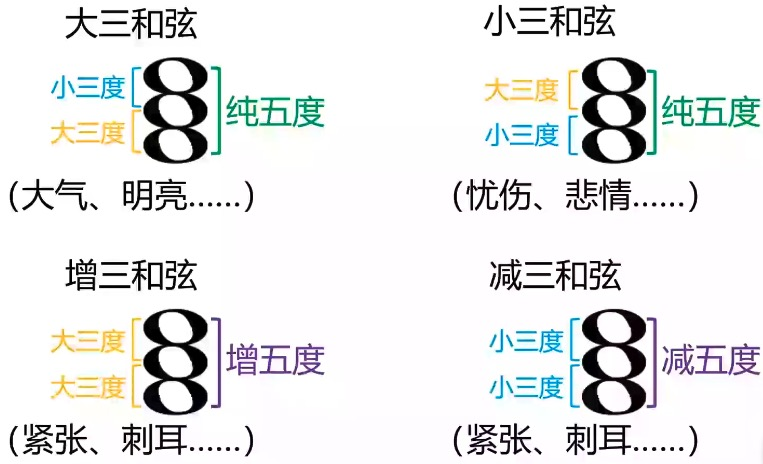

# 基础乐理

## 唱名

```
1   2   3   4   5    6   7   0
do  re  mi  fa  sol  la  si  休止符
```

- 全全半全全全半。
- 两种描述方式
    - 首调：首音不固定。用于唱谱更直观。
    - 固定调：1永远为C。用于乐谱更直观。


## 十二平均律

- C，<sup>#</sup>C，D，<sup>#</sup>D，E，F，<sup>#</sup>F，G，<sup>#</sup>G，A，<sup>#</sup>A，B
- 升降号：`#`，`b`。
- 重升重降号：`x`，`bb`。
- 相邻两个八度的相同音频率比为`1:2`。
- 两个相邻的音的距离是一个半音，两个半音的距离是一个全音。
- 音级：一个音就是一个音级
    - 基础音级：C，D，E，F，G，A，B
    - 变化音级：带升降号的。
        - 升音级，降音级，重升音级，重降音级。

## 音组


- 标准钢琴共88键，分9个八度。第一个八度只有后三个音，最后一个八度只有一个音，中间完整7个八度。
- 两种音组记号方法
    - Helmholtz：C<sub>2</sub>，C<sub>1</sub>，C，c，c<sup>1</sup>，c<sup>2</sup>，c<sup>3</sup>，c<sup>4</sup>，c<sup>5</sup>
    - Scientific：C0，C1，C2，C3，C4，C5，C6，C7，C8

- 中央C：`C4`
- 标准音：`A4`，`440Hz`

- 一个发声物品能发出的所有音的范围称为该物品的`音域`。

## 调式

> 若干高低不同的乐音，围绕某一有稳定感的中心音，按一定的音程关系组织在一起，成为一个有机的关系，称为调式。

- 自然大调式：全全半全全全半，即1234567.
    - C大调：C，D，E，F，G，A，B，C
    - <sup>#</sup>C大调：<sup>#</sup>C，<sup>#</sup>D，<sup>#</sup>E，<sup>#</sup>F，<sup>#</sup>G，<sup>#</sup>A，<sup>#</sup>B，<sup>#</sup>C
    - <sup>b</sup>D大调：<sup>b</sup>D，<sup>b</sup>E，F，<sup>b</sup>G，<sup>b</sup>A，<sup>b</sup>B，C，<sup>b</sup>D
        - <sup>#</sup>C大调 = <sup>b</sup>D大调，`等音调`。
    - 全部12个音，衍生出35个音名作为主音，忽略包含有重升重降复杂符号的大调，一共有15种自然大调，包含3对等音调。


- 零碎概念

    - 原调：曲子本身的定调。

    - 移调：将原调移到某个位置。降调、升调。

    - 转调：曲子中改变基本调式。
    - 离调：曲子中短暂的离开基本调式，插入一段其他调式的音。

## 音阶

> 将调式中的音，从以主音开始到以主音结束，由低到高（叫做上行），或者由高到低（叫做下行），以阶梯状排列起来，叫做音阶。

- 主音开始，主音结束。
- 主音与主音之间是单调有序的。
- 主音与主音之间包含该调式的所有音。

## 节拍

- X分音符具体是多长时间，由**乐谱的速度**决定。


- 附点：延长音符本身时间的一半。
- $\frac{X}{Y}$拍：以Y分音符为一拍，每小节有X拍。
    - 常见拍子：$\frac{2}{4}$，$\frac{3}{4}$，$\frac{4}{4}$，$\frac{3}{8}$，$\frac{6}{8}$
- 不同的节拍决定了不同的强弱关系。
    - 单拍子：每小节只有一个强拍。
    - 复拍子：多个相同单拍子组合起来。
    - 混合拍子：多个不同的单拍子组合起来。
    - 一拍子：**每小节只有一拍**的拍子。
    - 散拍子：无规律的拍子。

## 五线谱

- 高音谱号（G谱号）代表从下往上第二条线为g<sup>1</sup>。


- 低音谱号（F谱号）代表从下往上第四条线为f。


- 中音谱号（C谱号）代表中间线为c<sup>1</sup>。


- 次中音谱号，中音谱号向上平移一格，从下往上第四条线为c<sup>1</sup>。

- 高八度记号*ottava alta*，范围内音符高八度演奏。


- 低八度记号*ottava bassa*，范围内音符低八度演奏。


- 高十五度记号*quindicesima alta*，提高两个八度。


- 低十五度记号*quindicesima bassa*，降低两个八度。


- 音值组合
    - 四分音符为一拍时，每一拍有符尾的音符连在一起。
    - 八三拍和八六拍，直接以三个八分音符时长为单位相连。
    - 如果音符位置无法直接划分，就把一个音符拆成多个可划分音符，**要加延音线**说明这本来为一个音。


- 调号：在五线谱开端对应位置加上升降号，代表该位置所有音及八度音统一升降。

## 音程

- 度数：X音到Y音的字母数量，包含X，Y。
- 音数：全音的数量。
- 音程：音与音之间的距离
    - 纯一度（0）
    - 小二度（0.5），大二度（1）
    - 小三度（1.5），大三度（2）
    - 纯四度（2.5）
    - 纯五度（3.5)
    - 小六度（4），大六度（4.5）
    - 小七度（5），大七度（5.5）
    - 纯八度（6） 
    - 上面几组，减0.5音数叫减，减1音数叫倍减。加0.5音数叫增，加1音数叫倍增。
        - 减三度（1），增三度（2.5）
        - 减四度（2），增四度（3），倍增四度（3.5）
- 相同音数的音程叫做`等音程`。
- 自然音程：可以只用白键构成的音程。
- 变化音程：自然音程以外的音程。
- 音程转位，利于快速计算音程


## 和弦

### 三和弦

- 三个间隔3度的相邻音。
  - 低到高：`根音`、`三音`、`五音`。



- 三和弦的**第一转位**：根音提高八度，其余不变。和弦跨度变为六度，称为`六和弦`。


- 三和弦的**第二转位**：在第一转位的基础上，三音再提高八度。称为`四六和弦`。


